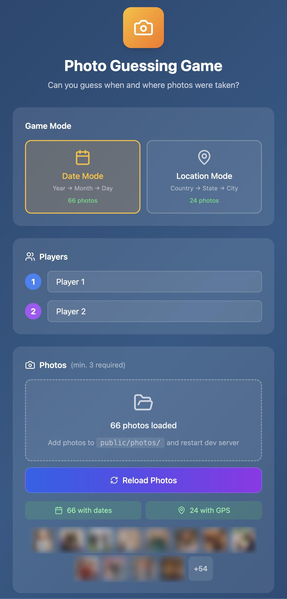
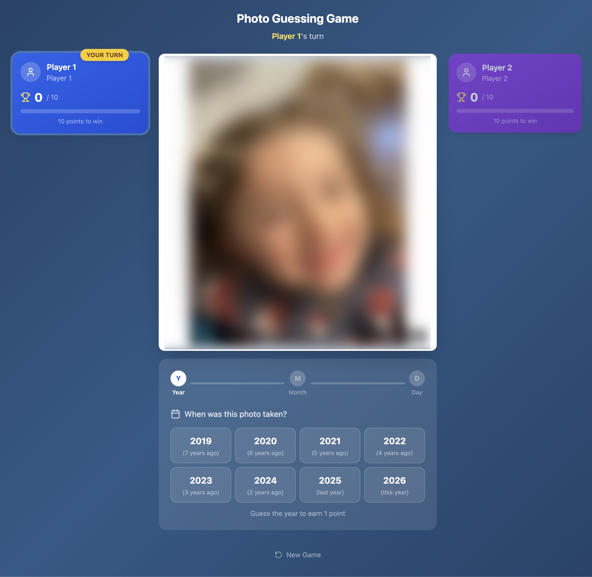
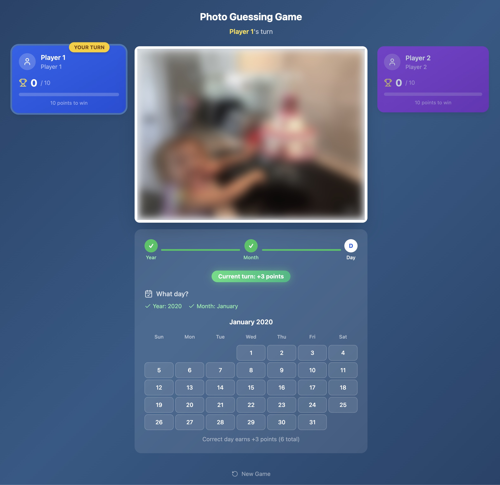
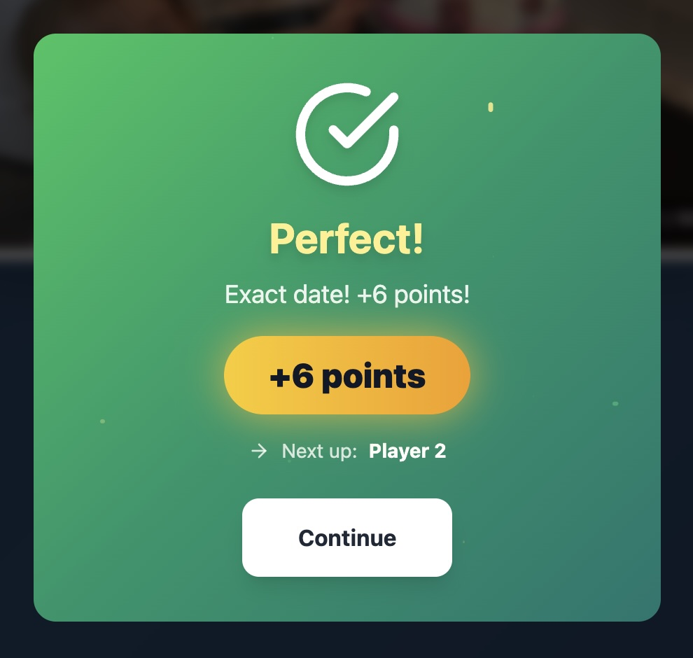
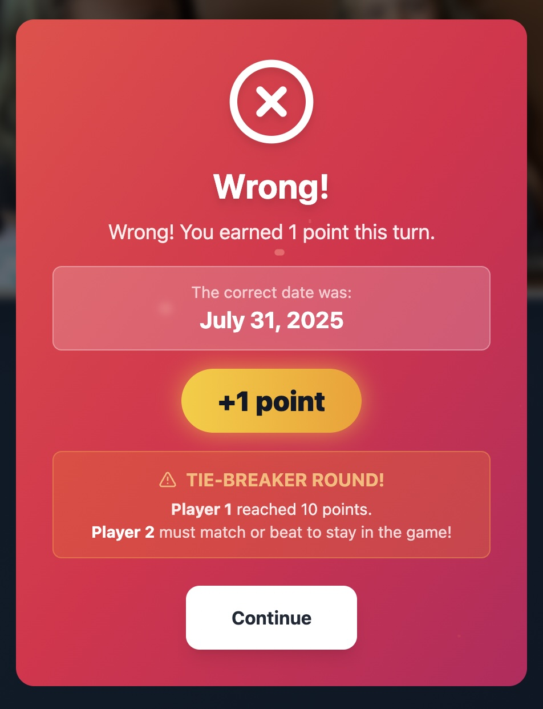

# Photo Guessing Game

A fun two-player party game where players take turns guessing when or where photos were taken. Test your memory and observation skills with photos from your own library!

## Screenshots

<p align="center">
  
  
</p>
<p align="center">
  
  
  
</p>

## Features

- **Two Game Modes**
  - **Date Mode**: Guess Year → Month → Day
  - **Location Mode**: Guess Country → State/Province → City

- **Two-Player Gameplay**
  - Alternating turns with fair tie-breaker system
  - Progressive scoring (1 + 2 + 3 = 6 points per perfect guess)
  - First to 10 points wins

- **Rich Feedback**
  - Visual animations for correct/incorrect answers
  - Sound effects synthesized with Web Audio API
  - Haptic feedback on mobile devices
  - Confetti celebration on victory

- **Cross-Platform**
  - Web browser (desktop and mobile)
  - iOS native app via Capacitor
  - Android native app via Capacitor

- **Privacy-First**
  - Photos stay on your device
  - No server required
  - Works completely offline

## Quick Start

### Prerequisites

- Node.js 18+
- npm 9+

### Installation

```bash
# Install dependencies
npm install

# Start development server
npm run dev
```

Open http://localhost:5173 in your browser.

### Adding Photos

1. Place JPEG photos with EXIF metadata in `public/photos/`
2. Run `npm run generate-manifest` to extract metadata
3. Photos need either date or GPS data depending on game mode

## How to Play

1. **Setup**
   - Enter names for Player 1 and Player 2
   - Choose game mode (Date or Location)
   - Load photos from your device

2. **Gameplay**
   - View the current photo
   - Make your guess for the current phase (Year/Country first)
   - Correct guess? Move to next phase (Month/State, then Day/City)
   - Wrong guess? Turn ends, next player's turn

3. **Scoring**
   | Phase | Points |
   |-------|--------|
   | Year/Country | 1 |
   | Month/State | +2 (total: 3) |
   | Day/City | +3 (total: 6) |

4. **Victory**
   - First player to 10 points wins
   - Tie-breaker ensures both players get equal turns

## Available Scripts

| Script                      | Description                            |
| --------------------------- | -------------------------------------- |
| `npm run dev`               | Start development server               |
| `npm run build`             | Build for production                   |
| `npm run preview`           | Preview production build               |
| `npm run generate-manifest` | Generate photo manifest from EXIF data |
| `npm run cap:sync`          | Build and sync to native projects      |
| `npm run cap:ios`           | Build and open in Xcode                |
| `npm run cap:android`       | Build and open in Android Studio       |
| `npm run cap:run:ios`       | Build and run on iOS device            |
| `npm run cap:run:android`   | Build and run on Android device        |

## Mobile Development

This app uses [Capacitor](https://capacitorjs.com/) for native iOS and Android builds.

### iOS Development

```bash
# Build and open in Xcode
npm run cap:ios

# Or build and run on connected device
npm run cap:run:ios
```

Requirements:

- macOS with Xcode 14+
- iOS Simulator or physical device
- Apple Developer account (for device testing)

### Android Development

```bash
# Build and open in Android Studio
npm run cap:android

# Or build and run on connected device
npm run cap:run:android
```

Requirements:

- Android Studio with SDK 33+
- Android Emulator or physical device

## Technology Stack

| Category   | Technology                  |
| ---------- | --------------------------- |
| Framework  | React 18 + Vite             |
| Language   | JavaScript/TypeScript       |
| Styling    | Tailwind CSS                |
| Animations | Framer Motion               |
| State      | Zustand with persistence    |
| Audio      | Web Audio API (synthesized) |
| Mobile     | Capacitor 8                 |
| EXIF       | exifr library               |

## Project Structure

```
photo-guessing-game/
├── src/
│   ├── components/        # React UI components
│   ├── stores/            # Zustand state management
│   ├── hooks/             # Custom React hooks
│   ├── services/          # Platform services
│   ├── utils/             # Utility functions
│   └── data/              # Constants and config
├── public/
│   └── photos/            # Photo storage (gitignored)
├── scripts/
│   └── generate-manifest.js
├── ios/                   # Capacitor iOS project
├── android/               # Capacitor Android project
├── docs/                  # Documentation
│   ├── CAPACITOR_PLAN.md  # Mobile implementation guide
│   └── REACT_NATIVE_PLAN.md
└── capacitor.config.ts    # Capacitor configuration
```

## Documentation

- [Capacitor Implementation Plan](docs/CAPACITOR_PLAN.md) - Guide for mobile app development
- [React Native Plan](docs/REACT_NATIVE_PLAN.md) - Alternative native implementation strategy

## Privacy

This game is designed with privacy in mind:

- **No data collection**: Your photos and game data stay on your device
- **No network required**: The game works completely offline
- **Local processing**: EXIF extraction and geocoding happen on-device
- **No accounts**: No sign-up or login required

Photo manifest files (`manifest.json`, `.manifest-cache.json`) contain extracted GPS coordinates and should not be shared publicly.

## License

GPL-2.0 License - See [LICENSE.md](LICENSE.md) for details.

## Author

Created by [Geoff Myers](https://www.geoffmyers.com)
