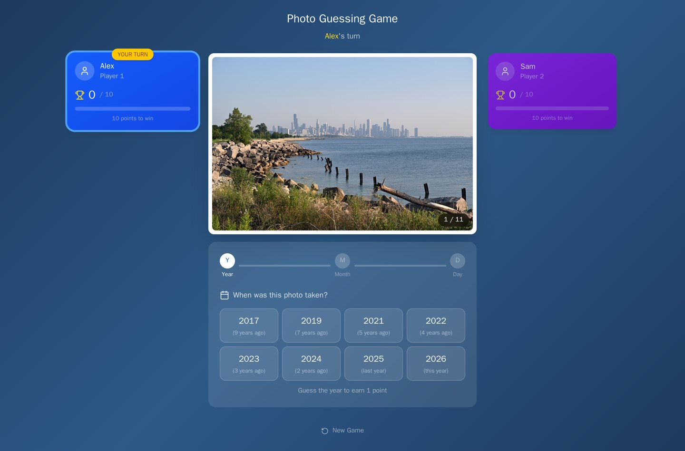
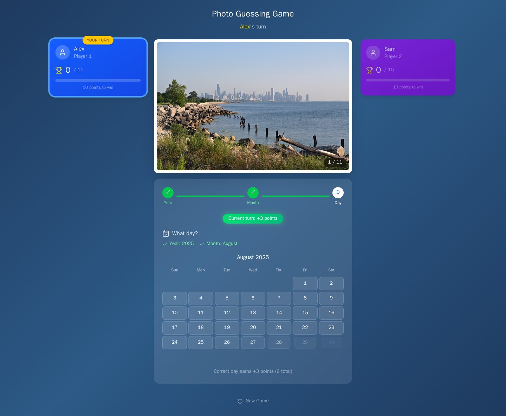
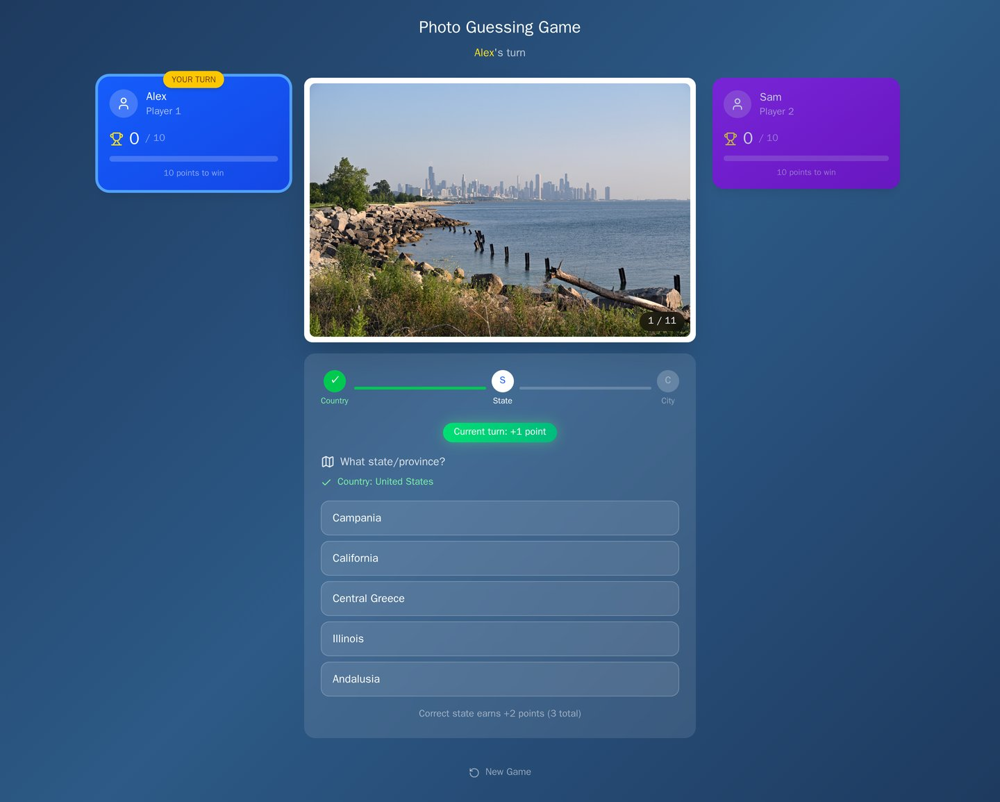
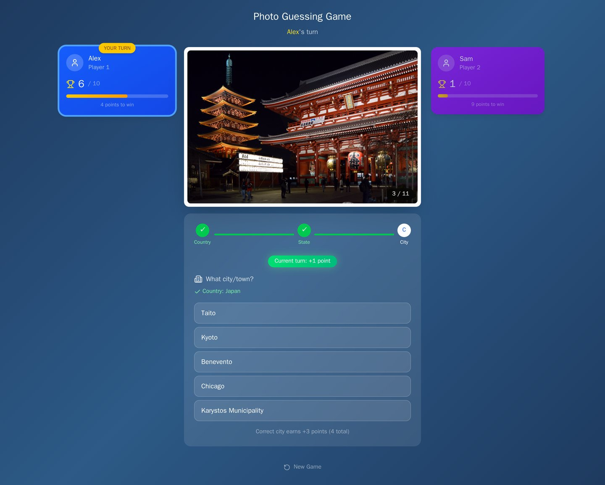
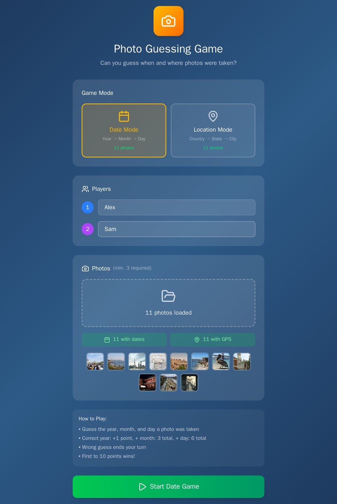
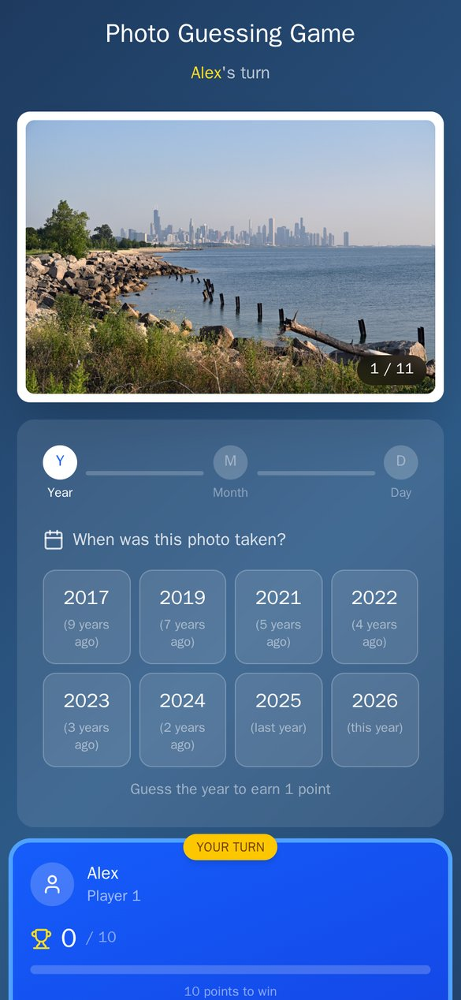

<p align="center">
  
</p>

# Photo Guessing Game

<!-- BADGES:START -->


[](https://github.com/geoffmyers/photo-guessing-game/releases/latest)
[](LICENSE.md)
[](CONTRIBUTING.md)
<!-- BADGES:END -->

## Table of Contents

- [Description](#description)
- [Screenshots](#screenshots)
- [Features](#features)
- [Requirements](#requirements)
- [Installation](#installation)
- [Usage](#usage)
  - [Adding photos to the web version](#adding-photos-to-the-web-version)
  - [Setting up a game](#setting-up-a-game)
  - [Taking a turn](#taking-a-turn)
  - [Scoring and winning](#scoring-and-winning)
  - [iOS and Android](#ios-and-android)
  - [macOS desktop app](#macos-desktop-app)
  - [npm scripts](#npm-scripts)
- [Privacy](#privacy)
- [Architecture](#architecture)
- [Credits](#credits)
- [Contributing](#contributing)
- [License](#license)

## Description

A two-player party game played with your own photos. The game shows a photo and
the players take turns guessing **when** it was taken (year, then month, then
day) or **where** (country, then state, then city). Each correct answer is worth
more than the last, a wrong answer ends the turn, and the first player to 10
points wins.

One React code base runs in three places:

- in a web browser, with photos you put in the project folder;
- as an iOS or Android app ([Capacitor](https://capacitorjs.com/)), with photos
  picked from the phone's library;
- as a macOS desktop app ([Electron](https://www.electronjs.org/)), with photos
  picked from disk.

**Play the web version at
[photo-guessing-game.geoffmyers.com](https://photo-guessing-game.geoffmyers.com)**,
with public-domain photos from Wikimedia Commons in place of your own.

The dates come from each photo's EXIF metadata. The places come from its GPS
position, looked up through OpenStreetMap's Nominatim service.

A native Apple TV version lives in its own repository,
[photo-guessing-game-tvos](https://github.com/geoffmyers/photo-guessing-game-tvos).

## Screenshots

<p align="center">
  
</p>

<p align="center"><em>A date game: the first question asks for the year.</em></p>

<p align="center">
  
  
</p>

<p align="center"><em>The day question, answered from a calendar of the right month, and a perfect turn.</em></p>

<p align="center">
  
  
</p>

<p align="center"><em>A location game at the state question, and a wrong answer, which shows the right one and keeps the point already won.</em></p>

<p align="center">
  
  
</p>

<p align="center"><em>A photo with no state skips that question, and the end of a match.</em></p>

<p align="center">
  
  
</p>

<p align="center"><em>Setup with a photo library loaded, and the game on a phone-sized screen.</em></p>

These are captures of the production web build in headless Chromium, played by
a script. The photos are public-domain (CC0) pictures from Wikimedia Commons,
credited under [Credits](#credits).

## Features

- **Two game modes.** The date game asks for the year, month and day; the
  location game asks for the country, the state or region, and the city.
- **A three-step scoring ladder** worth 1, 2 and 3 points, so a perfect turn
  scores 6 and gets a confetti celebration.
- **Your own photos.** Dates are read from EXIF metadata and places from the
  photo's GPS position.
- **Place names from OpenStreetMap,** in English by default. The language is a
  setting in `src/data/game-config.json`.
- **A fair finish.** If Player 1 reaches 10 first, Player 2 gets a turn to
  answer, and a tie plays on.
- **Web, iOS, Android and macOS** from one code base, with the photo picker,
  storage and haptics each platform provides.
- **A native macOS app** with its own menu, ⌘N for a new game, ⌘O to pick
  photos, and a notification when someone wins.
- **Synthesised sound effects.** The Web Audio API generates the clicks,
  arpeggios and fanfare, so the app ships no audio files.
- **It remembers the players.** Names and the chosen mode are saved in the
  platform's local storage. A game in progress is not: a reload starts at the
  setup screen.

## Requirements

For every version:

- **Node.js 22.12** or newer and npm. The web version alone builds with Node.js
  20.19 or newer; the Capacitor tools need 22.
- **Photos with metadata.** The date game needs photos with an EXIF capture
  date (`DateTimeOriginal`, `CreateDate` or `DateTime`); the location game needs
  photos with a GPS position. Each mode needs at least 3 such photos.
- **Network access to `nominatim.openstreetmap.org`** for the location game.

For the phone apps:

- **iOS:** a Mac with Xcode 26 or newer, and an iPhone or simulator on iOS 15
  or newer. A physical device also needs an Apple developer account to sign the
  app with; the project ships with a placeholder team.
- **Android:** Android Studio 2025.2.1 or newer, and a phone or emulator on
  Android 7.0 (API 24) or newer.

For the desktop app:

- **macOS 11** or newer. The app packages only on a Mac.
- To share a build with other Macs: an Apple Developer ID certificate and
  notarization credentials (see
  [docs/MACOS_DISTRIBUTION.md](docs/MACOS_DISTRIBUTION.md)).

## Installation

Ready-made apps are on the
[Releases](https://github.com/geoffmyers/photo-guessing-game/releases/latest)
page: the macOS app (Apple silicon and Intel), an unsigned iOS build to sign
yourself, and a debug-signed Android APK.

```bash
git clone https://github.com/geoffmyers/photo-guessing-game.git
cd photo-guessing-game
npm install
```

Then add some photos (next section) and start the development server:

```bash
npm run dev
```

and open <http://localhost:5173>.

## Usage

### Adding photos to the web version

The web version plays the photos in `public/photos/`:

1. Copy photos into `public/photos/`. JPEG works in every browser; HEIC shows
   only in Safari. PNG and TIFF are read too, but rarely carry a capture date or
   GPS position.
2. Run `npm run dev` or `npm run build`. Both first run
   `scripts/generate-manifest.js`. It reads each photo's EXIF data and looks up
   each GPS position on Nominatim, one request per second. The results go to
   `public/photos/manifest.json`, which the game loads.
3. The lookups are cached in `.manifest-cache.json` at the project root, so
   later runs only process new or changed photos. Use
   `npm run generate-manifest -- --force` to redo them all, for example after
   changing the place-name language.

A production build (`npm run build`) plays the photos it was built with, so it
shows neither this hint nor a reload button.

Photos and the manifest are ignored by git. To get place names in another
language, set `geocoding.language` in `src/data/game-config.json` (or the
`GEOCODE_LANGUAGE` environment variable for one run) to a language code such as
`fr`.

A build that ships someone else's photos should credit them. Set
`VITE_PHOTO_CREDITS_URL` when building (for example
`VITE_PHOTO_CREDITS_URL=/credits.html npm run build`) and the setup screen links
to that page.

### Setting up a game

1. Choose **Date Mode** or **Location Mode**. Each shows how many of the loaded
   photos it can use.
2. Enter a name for each player.
3. On iOS, Android and macOS, pick photos with **Select Photos** (up to 30 at a
   time). The web version loads its photos automatically; **Reload Photos**
   reads the manifest again.
4. Start the game. The photos are shuffled and each is shown once.

### Taking a turn

The current player sees a photo and answers one question at a time.

| Mode | Question 1 | Question 2 | Question 3 |
|---|---|---|---|
| Date | Year, from 8 choices | Month | Day, from a calendar of that month |
| Location | Country, from up to 5 | State or region, from up to 5 | City, from up to 5 |

The 8 years are within ten years of the answer, never before 1900 or after the
current year. The place choices are drawn from **every** place in the loaded
photos, not only those in the answer's country, so a state question for a photo
of Chicago can offer Campania. If a photo has no state or no city on
OpenStreetMap, that question is skipped.

A correct answer banks its points and moves to the next question. A wrong
answer shows the right one and ends the turn, but **the points already banked
are kept**. After the feedback card, **Continue** passes play to the other
player with a new photo.

### Scoring and winning

| Question | Points | Running total |
|---|---|---|
| 1 (year or country) | 1 | 1 |
| 2 (month or state) | 2 | 3 |
| 3 (day or city) | 3 | 6 |

The first player to **10 points** wins, with one rule to keep the turns even.
Player 1 always plays first, so if Player 1 reaches 10, Player 2 gets one more
turn:

- if Player 2 ends that turn ahead, Player 2 wins;
- if Player 2 ends behind, Player 1 wins;
- if the scores are level, play goes on, and the same rule applies after
  Player 1's next turn.

If Player 2 reaches 10 while Player 1 is still short of it, Player 2 wins at
once. If the photos run out first, the game shows the final scores without a
winner.

The winning score, the points, the number of choices and the place-name
lookup are set in `src/data/game-config.json`.

### iOS and Android

The `ios/` and `android/` folders are Capacitor projects. Each of these scripts
builds the web app, copies it into the native project, and then opens or runs
it:

```bash
npm run cap:ios            # open in Xcode
npm run cap:android        # open in Android Studio
npm run cap:run:ios        # build and run on a device or simulator
npm run cap:run:android
```

To run on an iPhone, choose your own team under *Signing & Capabilities* in
Xcode first. The app asks for access to the photo library the first time you
pick photos. It reads each photo's metadata on the phone and sends the GPS
positions to Nominatim from there.

### macOS desktop app

```bash
npm run electron:dev        # Vite and Electron together, with hot reload
npm run dist:mac:unsigned   # package a .dmg and .zip for your own Mac
```

**File → Select Photos…** (⌘O) opens a file dialog and **File → New Game**
(⌘N) starts over. Packages for Apple silicon and Intel land in `release/`.
Signing and notarizing a build for other Macs is covered in
[docs/MACOS_DISTRIBUTION.md](docs/MACOS_DISTRIBUTION.md).

### npm scripts

| Script | What it does |
|---|---|
| `npm run dev` | Generate the photo manifest, then start the Vite dev server |
| `npm run build` | Generate the photo manifest, then build to `dist/` |
| `npm run preview` | Serve the build in `dist/` |
| `npm run generate-manifest` | Read photo metadata and look up places (`-- --force` ignores the cache) |
| `npm run cap:sync` | Build and copy the web app into both native projects |
| `npm run cap:ios`, `cap:android` | Build, sync one platform and open its IDE |
| `npm run cap:run:ios`, `cap:run:android` | Build, sync one platform and run it |
| `npm run electron:dev` | Run the desktop app against the dev server |
| `npm run electron:start` | Run the desktop app against the existing `dist/` build |
| `npm run dist:mac` | Package for macOS, signed if a Developer ID certificate is in the keychain |
| `npm run dist:mac:unsigned` | Package for macOS without a signing identity |
| `npm run dist:mac:notarize` | Package, sign and notarize (needs `APPLE_TEAM_ID` and Apple ID credentials) |
| `npm run dist:mac:arm64`, `dist:mac:x64` | Package for one architecture |

`electron:build` is the same as `dist:mac`.

## Privacy

The game has no server, accounts or analytics. Two things do leave your device:

- **GPS positions go to Nominatim.** To name a place, the game sends the photo's
  coordinates to `nominatim.openstreetmap.org`, which the OpenStreetMap
  Foundation runs under its own
  [privacy policy](https://osmfoundation.org/wiki/Privacy_Policy). The web
  version does this when the manifest is generated, from the machine running
  it. The phone and desktop apps do it from the device, when photos are picked.
  Only the coordinates are sent, never the photo. A game that uses only the date mode still looks up every photo
  that has a GPS position.
- **A web build publishes its photos.** `npm run build` copies the photos into
  `dist/` with their metadata, GPS position included, next to a manifest of
  their dates and place names. Anyone who can open a deployed build can
  download all of it. Keep a build of personal photos on your own computer or
  private network. The GPS positions stay out of the manifest itself: they are
  kept in the lookup cache at the project root, which is not part of the build.

The phone and desktop apps read photos only when you pick them. Every version
keeps the player names and the chosen mode in local storage on the device.

## Architecture

| Path | What lives there |
|---|---|
| `src/App.jsx`, `src/main.jsx` | Entry point; switches between the setup screen and the game board |
| `src/stores/gameStore.js` | All game state and rules in one Zustand store; the names and mode are saved to local storage |
| `src/components/` | Setup, photo loader, game board, player panels, one selector per question, feedback card, winner screen, confetti |
| `src/utils/dateUtils.js` | Answer checking, points, question order and the answer choices |
| `src/utils/geocoding.js` | The Nominatim request and address reading, shared by the apps and the manifest generator |
| `src/data/game-config.json` | Rules and settings: winning score, points, choices, geocoding |
| `src/services/` | Platform detection, the native photo picker, EXIF reading and geocoding on the device, and storage |
| `src/hooks/` | Synthesised sound effects and haptics |
| `scripts/generate-manifest.js` | Builds the web version's photo manifest |
| `electron/` | The macOS main process, preload bridge and application menu |
| `ios/`, `android/`, `capacitor.config.ts` | The Capacitor native projects |
| `build/` | The desktop app's icon and signing entitlements |

See [ARCHITECTURE.md](ARCHITECTURE.md) for how a photo becomes a question on
each platform, and how the turn and tie-breaker rules work.

## Credits

- Built with [React](https://react.dev/), [Vite](https://vite.dev/),
  [Tailwind CSS](https://tailwindcss.com/), [Zustand](https://zustand.docs.pmnd.rs/),
  [Framer Motion](https://motion.dev/), [Lucide](https://lucide.dev/) icons,
  [exifr](https://github.com/MikeKovarik/exifr),
  [Capacitor](https://capacitorjs.com/) and
  [Electron](https://www.electronjs.org/).
- Place names come from [OpenStreetMap](https://www.openstreetmap.org/copyright)
  through the [Nominatim](https://nominatim.org/) reverse-geocoding service.
  OpenStreetMap data is © OpenStreetMap contributors and available under the
  Open Database License (ODbL).
- The photos in the screenshots are from Wikimedia Commons, released into the
  public domain (CC0) by
  [DimiTalen](https://commons.wikimedia.org/wiki/User:DimiTalen),
  [Ermell](https://commons.wikimedia.org/wiki/User:Ermell),
  [Bernard Gagnon](https://commons.wikimedia.org/wiki/User:Bgag) and
  [Jebulon](https://commons.wikimedia.org/wiki/User:Jebulon).
- iOS, macOS and Xcode are trademarks of Apple Inc., and Android is a trademark
  of Google LLC. This project is not affiliated with or endorsed by either.

Written by Geoff Myers.

## Contributing

Bug reports and pull requests are welcome. See [CONTRIBUTING.md](CONTRIBUTING.md)
for setup, checks and how this repository is published.

## License

This program is free software: you can redistribute it and/or modify it under
the terms of the GNU General Public License as published by the Free Software
Foundation, either version 3 of the License, or (at your option) any later
version.

This program is distributed in the hope that it will be useful, but WITHOUT ANY
WARRANTY; without even the implied warranty of MERCHANTABILITY or FITNESS FOR A
PARTICULAR PURPOSE. See [LICENSE.md](LICENSE.md) for the full text of the GNU
General Public License.

SPDX-License-Identifier: `GPL-3.0-or-later`
